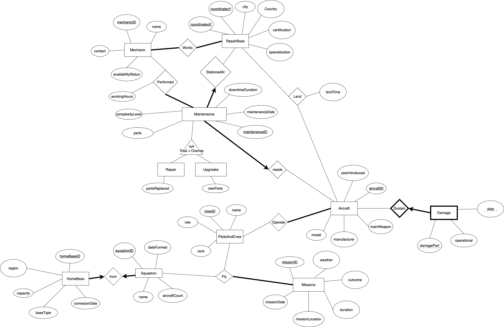
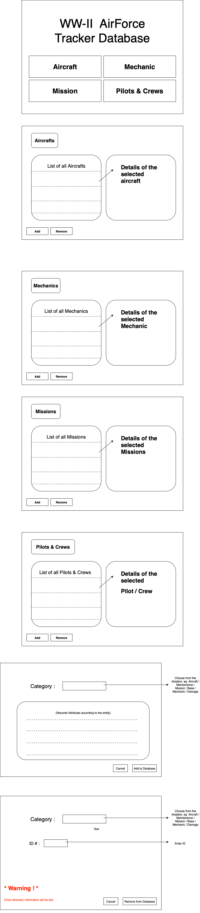

# AircraftTracker

## Overview
**AircraftTracker** is a database-driven application for managing the **maintenance, operations, and assignments of military aircraft and crews**.  
The system is designed to support decision-making in aviation by keeping detailed records of:
- Aircraft models and categories
- Maintenance and repair history
- Squadron and crew assignments
- Mission performance and outcomes
- Damage assessments and repair planning
- Homebase management and logistics

While initially scoped for **WW2 fighter and bomber aircraft**, the design can be adapted for modern military or commercial aviation contexts.

---

## Domain Modeling
The database models the following key aspects of the aviation domain:

- **Aircraft Management** – Categorization of aircraft by type, model, and service history.  
- **Maintenance** – Tracking repairs, upgrades, downtime, and performed tasks.  
- **Squadron & Crew** – Assigning pilots and crew to squadrons, monitoring ranks, and mission roles.  
- **Operations** – Documenting missions with dates, locations, aircraft, and crew involvement.  
- **Damage Assessment** – Recording and categorizing damages, parts affected, and operational readiness.  
- **Homebase Management** – Assigning squadrons to bases and managing logistical resources.

---

## Functionality
The database and application provide the following capabilities:

- Track aircraft registry and maintenance history.  
- Record damages and categorize by affected systems and operational status.  
- Assign and manage crew members for missions.  
- Generate insights, such as:
  - Survival rates of experienced vs. inexperienced crews.  
  - Aircraft vulnerability to specific types of damage.  
  - Predictions of remaining lifespan of aircraft based on hours, damages, and maintenance.  
- Support repair/retirement decisions with structured reports.  

---

## Technology Stack

**Database:**  
- Oracle DB (relational database system)  

**Application & Frontend:**  
- JavaScript  
- HTML, CSS  
- React, Angular  
- React Query, React Router  
- React Hook Form, React Spring  
- Zustand (state management)  

> Note: The listed libraries are potential tools; not all may be implemented. The stack may evolve as development progresses.

## ERD Diagram



## UI



## Getting Started

### Prerequisites
Make sure you have the following installed on your system:
- [Node.js](https://nodejs.org/) (LTS recommended, e.g. v18+)
- npm (comes with Node.js) or yarn
- [Oracle DB](https://www.oracle.com/database/) (used as the backend database)
- A SQL client/tool to run schema files (e.g., `sqlplus`)

---

### Setup Instructions

1. **Clone the repository**
   ```
   git clone https://github.com/MengenL-ds/Aircraft-Tracker.git
   cd Aircraft-Tracker
   ```

2. **Install dependencies**
    ```
    npm install
    ```

3. **Set up the database**
    - Create a new database in Oracle
    - Run the schema file to create the required tables:
    ```
    sqlplus <username>/<password>@<connection_string> @project.sql
    ```

4. **Configure environment variables**
    - Create a .env file in the root directory with the following values:
    ```
    DB_USER=your_db_username
    DB_PASSWORD=your_db_password
    DB_HOST=localhost
    DB_PORT=1521
    DB_NAME=aircraft_db
    PORT=3000
    ```

5. **Start the app**
    ```
    node server.js
    ```

6. **Access the app**
    - Open your desired browser and go to:
    ```
    http://localhost:3000